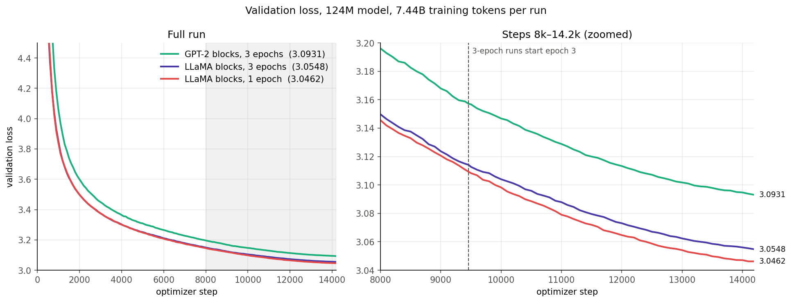

# nanogpt_project

A GPT-2 (124M) language model trained from scratch in PyTorch, with a resumable training script, HellaSwag evaluation and sampling. The model can switch between GPT-2-style blocks and LLaMA-style blocks (RMSNorm, SwiGLU, RoPE).
Built following Andrej Karpathy's [nanoGPT](https://github.com/karpathy/nanoGPT) and his [build-nanogpt](https://github.com/karpathy/build-nanogpt) GPT-2 (124M) reproduction, then extended with LLaMA-style blocks, resumable mid-epoch checkpoints,kv-cache and the data-repetition experiment below.


## Experiment: what helps a 124M model at a fixed compute budget?

<!-- VALIDATION LOSS PLOT: replace the line below with the image, e.g.  -->


Three runs with the same compute (14,190 optimizer steps × 524,288 tokens = **7.44B tokens**) changed one thing at a time:

1. **Block design:** GPT-2-style → LLaMA-style blocks, with the same data.
2. **Data freshness:** 2.48B unique tokens seen 3 times → 7.44B unique tokens seen once, with the same blocks.

### Shared setup

| | |
|---|---|
| data | FineWeb-Edu `sample-10BT`, GPT-2 BPE; the **validation set (10M tokens) is byte-identical across all runs** |
| model | 12 layers, 12 heads, 768 wide, context 1,024, vocab 50,304 (GPT-2's 50,257 padded to a multiple of 64) |
| batch | 524,288 tokens per optimizer step (2^19) |
| optimizer | AdamW (0.9, 0.95), weight decay 0.1, grad clip 1.0 |
| LR schedule | max 6e-4, 5% linear warmup, cosine decay to 6e-5 |
| precision | bf16 autocast, `torch.compile`, 1 × A100 (Colab) |
| seed | 1337, a single seed per run |
| val loss | every 100 steps, on the same 20 fixed val batches (~1.3M tokens) |
| HellaSwag | full validation set (10,042 examples), `acc_norm` = token-length-normalized (llm.c convention) |

### Scorecards

**Run 1: Baseline (GPT-2-style, 3 epochs)**

| metric | value |
|---|---|
| architecture | GPT-2 124M (LayerNorm, GELU, learned positions) |
| parameters | 124,475,904 |
| data | FineWeb-Edu, 2.48B unique × 3 epochs = 7.44B tokens |
| steps | 14,190 |
| final train loss | 3.0331 |
| val loss | **3.0931** (perplexity 22.05) |
| HellaSwag acc_norm | 0.3014 |
| HellaSwag acc | 0.2894 |
| MFU | 56.3% |
| ms / step | 2,546 |
| training time | 10 h 31 min (wall clock) |

**Run 2: LLaMA-style blocks, 3 epochs**

| metric | value |
|---|---|
| architecture | RMSNorm, SwiGLU, RoPE (bias kept on) |
| parameters | 123,682,560 (−793,344 vs baseline: no learned position table) |
| data | FineWeb-Edu, 2.48B unique × 3 epochs = 7.44B tokens (same as Run 1) |
| steps | 14,190 |
| final train loss | 2.9935 |
| val loss | **3.0548** (perplexity 21.22) |
| HellaSwag acc_norm | 0.3042 |
| HellaSwag acc | 0.2900 |
| MFU | 51.9% |
| ms / step | 2,770 |
| training time | ~10.9 h (step time only, evals excluded) |

**Run 3: LLaMA-style blocks, 1 epoch of fresh data**

| metric | value |
|---|---|
| architecture | RMSNorm, SwiGLU, RoPE (same as Run 2) |
| parameters | 123,682,560 |
| data | FineWeb-Edu, 7.44B unique × 1 epoch = 7.44B tokens (~60 tokens per parameter) |
| steps | 14,190 (crashed near step 10,000, resumed from the checkpoint) |
| final train loss | 3.0240 |
| val loss | **3.0462** (perplexity 21.04) |
| HellaSwag acc_norm | 0.3056 |
| HellaSwag acc | 0.2891 |
| MFU | 56.4% |
| ms / step | 2,546 |
| training time | ~10.0 h (step time only; evals, crash and resume excluded) |

### Side by side

| run | val loss | Δ vs baseline | train − val gap | HellaSwag acc_norm |
|---|---|---|---|---|
| 1. GPT-2-style, 3 epochs | 3.0931 | — | −0.060 | 0.3014 |
| 2. LLaMA-style, 3 epochs | 3.0548 | −0.0383 | −0.061 | 0.3042 |
| 3. LLaMA-style, 1 epoch | **3.0462** | **−0.0469** | −0.022 | 0.3056 |

### Findings

1. **LLaMA-style blocks gave the largest improvement.** Val loss fell by 0.038 nats (−3.8% perplexity), with 0.8M fewer parameters. Run 2 matched the baseline's *final* val loss at about step 10,800 of 14,190, so the same quality took ~24% less compute. The switch changes three components (norm, MLP, position encoding), so the gain can't be credited to any one of them, such as RoPE alone.
2. **Fresh data beat repeated data, but only slightly.** At equal compute, 7.44B unique tokens beat 2.48B tokens × 3 epochs by 0.009 nats (−0.9% perplexity), about a quarter of the block-design gain. This matches Muennighoff et al. (2023), *Scaling Data-Constrained Language Models*: up to about 4 epochs, repeated tokens are worth almost as much as fresh ones.
3. **The train − val gap shows memorization.** In the 3-epoch runs, the final train loss is measured on text the model has already seen twice, and it sits 0.06 below val. In the 1-epoch run, every training batch is new, and the gap shrinks to 0.02, which is ordinary sampling noise between two text sets. Repetition made the models fit the training text better without making them better on new text.
4. **HellaSwag can't tell these models apart.** All three are within 0.42 percentage points of each other, while the standard error at 10,042 examples is about 0.46 pp. Its ranking matches the val loss ranking, but no gap is significant. At 124M parameters these models sit near HellaSwag's floor. For reference, OpenAI's GPT-2 124M scores ~0.2955.
5. **Throughput differs between runs of the same architecture.** Run 3 reached 56.4% MFU with the same blocks as Run 2 (51.9%), so the per-step speed gap between Runs 1 and 2 is not caused by the architecture alone.
6. **Samples don't rank the models.** All three write fluent text with confident factual errors and repetition loops, as is normal at this size. Single random samples vary too much to compare models this close; val loss does.

### Limitations

- One seed per run, so there are no error bars on val loss.
- Val loss uses ~1.3M tokens (20 batches) of the 10M-token val set. The 0.009 difference between Runs 2 and 3 should be confirmed on the full `val.bin`.
- HellaSwag is the only downstream benchmark, and it has almost no resolving power at 124M.

### Reproduce

| setting in `config/train_config.py` | Run 1 | Run 2 | Run 3 |
|---|---|---|---|
| `norm` / `mlp` / `pos_emb` | `layernorm` / `gelu` / `learned` | `rmsnorm` / `swiglu` / `rope` | `rmsnorm` / `swiglu` / `rope` |
| `max_epochs` | 3 | 3 | 1 |
| training data | `train.bin` (2.48B tokens) | `train.bin` | `train_1ep.bin` (7.44B tokens) |

1. **Data:** `python prepare_fineweb.py`. `TOKENS_PER_PARAM = 20` gives the 2.48B-token file, and `60` gives the 7.44B-token file. `dataset.py` currently reads `train_1ep.bin`, so change the file name there to rerun Runs 1–2.
2. **Train:** `python -u train.py`, with a new `out_dir` and `wandb_run_name` per run.
3. **Evaluate:** `python hellaswag.py --ckpt <out_dir>/best.pt`. Probe generations come from `Test_files/prompts.py`.

---

## Code

### Layout

```
nanogpt_project/
├── model.py              GPT model: GPTConfig, attention (with KV cache), MLP, blocks, generate()
├── dataset.py            token files or a text file (GPT-2 BPE), train/val split, DataLoaders
├── train.py              training loop: bf16 autocast, grad accumulation, DDP, W&B, checkpoints, resume
├── sample.py             generate text from a checkpoint or from OpenAI GPT-2 weights
├── hellaswag.py          HellaSwag accuracy of a checkpoint (acc and acc_norm)
├── prepare_fineweb.py    download and tokenize FineWeb-Edu into data/fineweb/
├── config/
│   ├── train_config.py   every setting for train.py (TrainConfig)
│   └── sample_config.py  every setting for sample.py (SampleConfig)
├── Test_files/           prompts.py (probe prompts), smokeTest.py, test_kv.py
├── unitTests/            pytest suite for model, sample and train
├── results/              HellaSwag JSONs and probe generations
└── requirements.txt
```

### Setup

```
pip install -r requirements.txt
wandb login            # or set wandb_log = False in config/train_config.py
```

### Train

All settings live in `config/train_config.py`; there are no command-line flags.

```
python train.py                                         # one GPU, or CPU
torchrun --standalone --nproc_per_node=4 train.py       # 4 GPUs on one machine (DDP)
```

`train.bin` / `val.bin` are memory-mapped, so they never load into RAM. On Colab, copy them to local disk (`/content/data`), because reading a memory map over Drive is slow. Keep `num_workers = 0`. `compile = True` needs Linux with an NVIDIA GPU.

```
for epoch in range(start_epoch, max_epochs):          # one pass over the training data
    for step in range(done_steps, steps_per_epoch):   # one optimizer update; iter_num += 1
        for micro_step in range(grad_accum_steps):    # one micro-batch of batch_size × block_size tokens
            forward + backward (gradients add up)
        clip gradients, optimizer.step()
        log every log_interval steps; evaluate + checkpoint every eval_interval steps and at the end of each epoch
```

| variable | meaning | Run 3, 1 GPU |
|---|---|---|
| `batch_size` × `block_size` | tokens per micro-batch | 64 × 1,024 |
| `total_batch_size` | tokens per optimizer step | 524,288 |
| `grad_accum_steps` | `total_batch_size / (batch_size × block_size × world_size)` | 8 |
| `steps_per_epoch` | full optimizer steps in one pass | 14,190 |
| `warmup_iters` | `warmup_frac × total_iters` | 709 |
| `iter_num` | steps done across epochs and resumes; drives the LR schedule, logging and resume | — |

### Checkpoints

At every evaluation (`eval_interval = 100` steps) and at the end of every epoch, rank 0 writes to `out_dir`:

| file | written | contents | size (124M) | used by |
|---|---|---|---|---|
| `ckpt.pt` | every evaluation, overwritten | weights + AdamW state + config, step, best val loss, W&B run id | ~1.4 GB | resuming |
| `best.pt` | when val loss reaches a new low | weights + architecture + config, step, val loss | ~475 MB | `sample.py`, `hellaswag.py` |

**One file per checkpoint.** Each `.pt` file is a single `torch.save` of a dict that holds both the architecture (`model_args`, the `GPTConfig` fields) and the weights (`model`, the state dict). Hugging Face instead splits these into two files (`config.json` + `model.safetensors`). Loading with `GPT.from_checkpoint` builds the model from `model_args`, then loads the state dict with `weights_only=True`. The GPT class code is still required. `best.pt` is smaller because it has no optimizer moments, and the tied `wte`/`lm_head` weight is stored once.

Every save goes to a temporary file first and is then renamed, so a crash mid-save leaves the previous checkpoint intact.

### Resume after a crash

Set `init_from = "resume"` and run `train.py` again. Training continues from the step of the last checkpoint, with the same LR schedule, optimizer state, data order and W&B run. The already-trained batches of the current epoch are skipped, which takes a few minutes of silence after the "skipping" line.

The config is first compared with the one saved in the checkpoint. Any difference in architecture, data, batch sizes, optimizer or LR schedule stops the resume with a list of every mismatch. These settings may change: `out_dir`, `data_dir`, `log_interval`, `eval_interval`, `eval_iters`, `eval_only`, `wandb_*`, `max_epochs`, `num_workers`, `backend`, `device`, `dtype`, `compile`. Changing `max_epochs` also stretches the cosine schedule.

### Sample and evaluate

```
python sample.py                                  # settings in config/sample_config.py
python hellaswag.py --ckpt out/best.pt            # ~2 min on an A100 for the full 10,042 examples
```

`sample.py` loads `out_dir/best.pt` by default, or OpenAI weights with `init_from = "gpt2"` (needs `transformers`). `generate()` uses a KV cache, so each new token runs attention only for itself.

### Notes

- GPUs without bfloat16 (V100, T4) fall back to float32. There is no float16 mode, because it would need a GradScaler.
- HellaSwag data comes from the `Rowan/hellaswag` Hugging Face mirror. The validation file is sorted by source, so `--limit` gives a biased subset; score the full set.
- `model.forward(idx)` without targets returns only the last position's logits; pass targets to score whole sequences.

## Credits

- **Andrej Karpathy:** [nanoGPT](https://github.com/karpathy/nanoGPT) and [build-nanogpt](https://github.com/karpathy/build-nanogpt), the base for the model, training loop and GPT-2 124M setup; [llm.c](https://github.com/karpathy/llm.c) for the HellaSwag `acc_norm` convention.
- **Data:** [FineWeb-Edu](https://huggingface.co/datasets/HuggingFaceFW/fineweb-edu) (Hugging Face); [HellaSwag](https://arxiv.org/abs/1905.07830) (Zellers et al., 2019), via the `Rowan/hellaswag` mirror.
- **Architecture:** GPT-2 (Radford et al., 2019); LLaMA-style blocks from [LLaMA](https://arxiv.org/abs/2302.13971) (Touvron et al., 2023): [RMSNorm](https://arxiv.org/abs/1910.07467) (Zhang & Sennrich, 2019), [SwiGLU](https://arxiv.org/abs/2002.05202) (Shazeer, 2020), [RoPE](https://arxiv.org/abs/2104.09864) (Su et al., 2021).
- **Training setup:** hyperparameters from [GPT-3](https://arxiv.org/abs/2005.14165) (Brown et al., 2020); token budget from [Chinchilla](https://arxiv.org/abs/2203.15556) (Hoffmann et al., 2022).
- **Data repetition:** [Scaling Data-Constrained Language Models](https://arxiv.org/abs/2305.16264) (Muennighoff et al., 2023).
